<!-- Transparent Banner (No Background) -->

 

<!-- Typing Animation -->

  

<!-- Badges -->

---

  

---

### Frontend

### Backend

### Database & Cache

### DevOps & Cloud

### Tools & Others

---

  <picture>
    <source media="(prefers-color-scheme: dark)" srcset="https://raw.githubusercontent.com/rezadesky/rezadesky/output/github-contribution-grid-snake-dark.svg"/>
    <source media="(prefers-color-scheme: light)" srcset="https://raw.githubusercontent.com/rezadesky/rezadesky/output/github-contribution-grid-snake.svg"/>
    
  </picture>

---

  

---

  

---

---

<!-- Footer Wave -->

